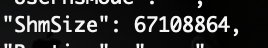
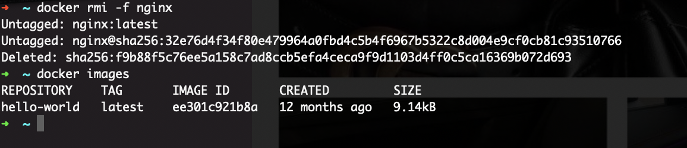
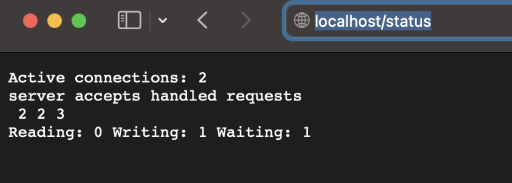
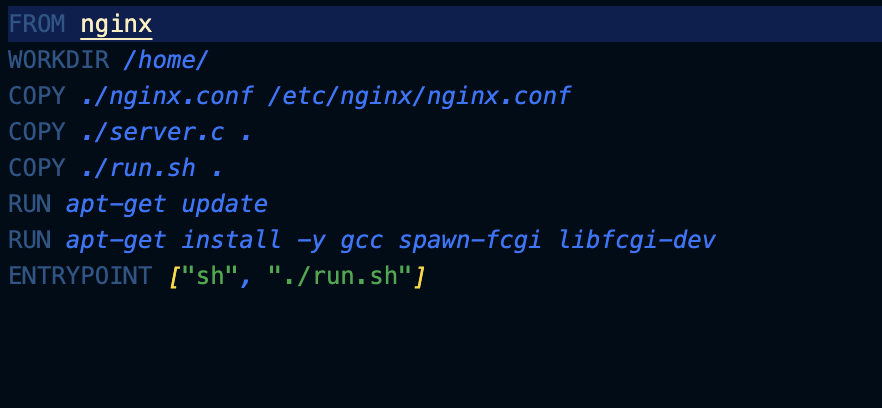

## Part 1. Готовый докер

##### Возьми официальный докер-образ с **nginx** и выкачай его при помощи `docker pull`.

##### Проверь наличие докер-образа через `docker images`.
Проверяем наличие докер образа

##### Запусти докер-образ через `docker run -d [image_id|repository]`.
Запускаем докер командой docker run -d nginx

##### Проверь, что образ запустился через `docker ps`.

##### Посмотри информацию о контейнере через `docker inspect [container_id|container_name]`.
Иформация контейнера

##### По выводу команды определи и помести в отчёт размер контейнера, список замапленных портов и ip контейнера.
Размер контейнера

Список замапленных портов

IP контейнера

##### Останови докер образ через `docker stop [container_id|container_name]`.
Остановка докер-образа

##### Проверь, что образ остановился через `docker ps`.

Тк контейнеры по-умолчанию запускаются с портом 80, то нужно изменить в его конфиге, на любой другой порт (я изменила на порт 90). После чего запускаем докер-образ.

##### Проверь, что в браузере по адресу *localhost:80* доступна стартовая страница **nginx**.
Для начала проверим, что докер-образ запустился командой docker ps. Все ок, у нас он запущен. Далее проверим стартовую страницу nginx

##### Перезапусти докер контейнер через `docker restart [container_id|container_name]`.

##### Проверь любым способом, что контейнер запустился.

## Part 2. Операции с контейнером

##### Прочитай конфигурационный файл *nginx.conf* внутри докер контейнера через команду *exec*.

##### Создай на локальной машине файл *nginx.conf*.
Создаем файл nginx.conf и прописываем в нем порт 80, также location = /status {stub_status on}; для того, чтобы появилась страница по адресу localhost/status с отображением статуса
##### Настрой в нем по пути */status* отдачу страницы статуса сервера **nginx**.

##### Скопируй созданный файл *nginx.conf* внутрь докер-образа через команду `docker cp`.

##### Перезапусти **nginx** внутри докер-образа через команду *exec*.

##### Проверь, что по адресу *localhost:80/status* отдается страничка со статусом сервера **nginx**.

##### Экспортируй контейнер в файл *container.tar* через команду *export*.

##### Останови контейнер.

##### Удали образ через `docker rmi [image_id|repository]`, не удаляя перед этим контейнеры. И удали остановленный контейнер.

##### Импортируй контейнер обратно через команду *import*.
 

##### Запусти импортированный контейнер.

##### Проверь, что по адресу *localhost:80/status* отдается страничка со статусом сервера **nginx**.

## Part 3. Мини веб-сервер

##### Напиши мини-сервер на **C** и **FastCgi**, который будет возвращать простейшую страничку с надписью `Hello World!`.

##### Напиши свой *nginx.conf*, который будет проксировать все запросы с 81 порта на *127.0.0.1:8080*.

##### Запусти написанный мини-сервер через *spawn-fcgi* на порту 8080.

##### Проверь, что в браузере по *localhost:81* отдается написанная тобой страничка.

##### Положи файл *nginx.conf* по пути *./nginx/nginx.conf* (это понадобится позже).

## Part 4. Свой докер

##### Напишем свой docker-образ, который собирает исходники 3-й части, запускает на порту 80, после копирует внутрь написанный нами nginx.conf и, наконец, запускает nginx (ниже приведены файлы run.sh и Dockerfile, файлы nginx.conf и server.c остаются с 3-й части)

#####  Соберем написанный docker-образ через команду docker build, при этом указав имя и тэг нашего контейнера

##### Проверь через `docker images`, что все собралось корректно.

##### Запусти собранный докер-образ с маппингом 81 порта на 80 на локальной машине и маппингом папки *./nginx* внутрь контейнера по адресу, где лежат конфигурационные файлы **nginx**'а

##### Проверь, что по localhost:80 доступна страничка написанного мини сервера.

##### Допиши в *./nginx/nginx.conf* проксирование странички */status*, по которой надо отдавать статус сервера **nginx**.

##### Перезапусти докер-образ.

##### Проверь, что теперь по *localhost:80/status* отдается страничка со статусом **nginx**

## Part 5. **Dockle**

##### Просканируй образ из предыдущего задания через `dockle [image_id|repository]`.
![dockle [image_id|repository]](png/ping5.1.png)

##### Исправь образ так, чтобы при проверке через **dockle** не было ошибок и предупреждений.

## Part 6. Базовый **Docker Compose**

##### Напиши файл *docker-compose.yml*, с помощью которого:

##### Замапь 8080 порт второго контейнера на 80 порт локальной машины.

##### Собери и запусти проект с помощью команд `docker-compose build` и `docker-compose up`.

##### Проверь, что в браузере по *localhost:80* отдается написанная тобой страничка, как и ранее.

